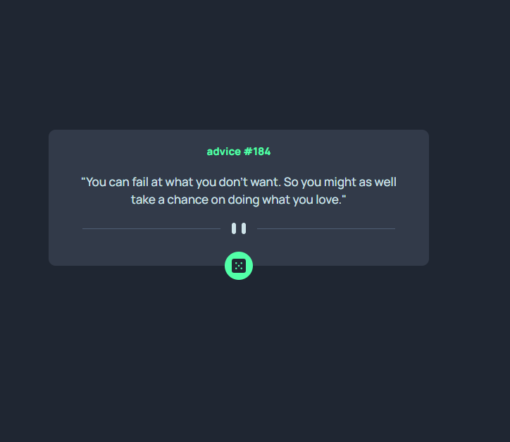

# Frontend Mentor - Advice Generator



## Welcome! 👋

Thanks for checking out this front-end coding challenge.

[Frontend Mentor](https://www.frontendmentor.io) challenges help you improve your coding skills by building realistic projects.

**To do this challenge, you need a basic understanding of HTML and CSS.**

## 📦 Instalação

Executar para clonar o projeto:

```bash
git clone https://github.com/Alencar-Bianca/Advice-Generator.git
```

Entrar na pasta usando cd e executar para instalar as dependências necessárias:

```bash
npm install
```
Executar para rodar o projeto:

```bash
ng s 
```

## 🚀 Tecnologias

Esse projeto está sendo desenvolvido com as seguintes tecnologias:

- Angular
- HTML
- SCSS

## 🚧 Projeto:

Link do Projeto: [Advice Generator Api](https://advicegeneratorapio.netlify.app/)
